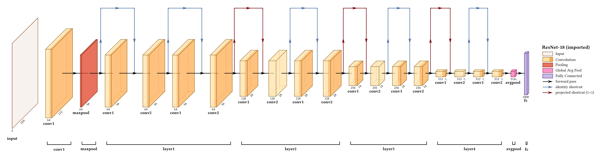
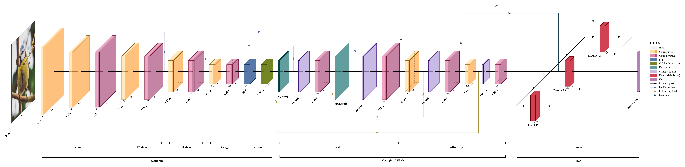

# neural-netz

Visualize Neural Network Architectures in high-quality diagrams using [Typst](https://typst.app), with style and API inspired by [PlotNeuralNet](https://github.com/HarisIqbal88/PlotNeuralNet).


[](https://hal.science/hal-05401124)&nbsp;
[](https://github.com/edgaremy/neural-netz/releases)&nbsp;
&nbsp;


<p align="center">


</p>

Under the hood, this package only uses the native Typst package [CeTZ](https://typst.app/universe/package/cetz/) for building the diagrams.

> This is the [j-vaught fork](https://github.com/j-vaught/neural-netz), version 0.4, extending [Edgar Remy's neural-netz 0.3](https://github.com/edgaremy/neural-netz) with parallel branches, tensor-shape sizing, automatic spacing and lanes, group brackets, repeat notation, connection styling and more. See the [changelog](CHANGELOG.md) for the full list.

## Documentation

**[The neural-netz manual](doc/neural-netz-manual.pdf)** is the reference: every
feature on its own, in the smallest figure that demonstrates it, with the code
beside each one. Every figure in it is compiled from the code printed next to it,
so the two cannot drift apart. Rebuild it with `doc/build.sh`.

This README is a tour. The manual is where you look up what one option does.

For writing neural-netz with an LLM, [`llms.txt`](llms.txt) is a single flat file
with every option, every layer type and forty worked examples, generated from the
package's own tables by `doc/gen-llms.py`.

## Usage

Simply import the all-in-one drawing function from the neural-netz package:
```typ
#import "@preview/neural-netz:0.4.0": draw-network
```
You can then call `draw-network` which has the following arguments:
```typ
#draw-network(
  layers,
  connections: (),
  groups: (),
  palette: "warm",
  show-legend: false,
  legend-title: "Layers",
  main-legend: none,
  scale: 100%,
  stroke-thickness: 1,
  depth-multiplier: 0.3,
  lane-unit: 0.75,
  shape-scale: (spatial: (1.2, -3.2), channels: (0.075, 0.0)),
  auto-gap: 0.55,
  show-relu: false,
)
```
See the examples in the following section to understand how to use it. Alternatively, you can also start from already written architecture examples (see the Examples section, near the end).

### Layers, and how to write them

A layer is a dictionary with a `type`, and every option below is a key in it. There is also
a constructor per type, which is the same thing with the `type` filled in:

```typ
#import "@preview/neural-netz:0.4.0": draw-network, input, conv, pool

#draw-network((
  input(image: "default", shape: (3, 640, 640)),
  conv(shape: (16, 320, 320), label: "P1/2"),
  conv(shape: (32, 160, 160), label: "P2/4"),
  pool(),
))
```

Prefer the constructors. Each one's signature is exactly the set of options that type
accepts, so an editor can list them while you type, and Typst rejects a misspelled argument
by name. The dictionary form stays supported everywhere, including inside `branches`, and
the two mix freely in one figure.

Either way an option a layer type does not read is an error rather than a silence:

```
error: unknown layer option "hieght" on layer 3 (type "conv"). Did you mean "height"?
```

That covers connection and group options too, along with an unknown layer `type` and a
connection or group naming a layer that has no such `name`. A key that is quietly ignored
produces a figure that is merely wrong, which reads as the package being broken rather than
as the typo it is.

## Getting started

Here are a few simple features for getting started.

### Basic layout

```typ
#draw-network((
    (type: "input", image: "default"),
    (type: "conv", offset: 2), // Next layers are automatically connected with arrows
    (type: "conv", offset: 2),
    (type: "pool"), // Pool layers are sticked to previous convolution block (by default))
    (type: "conv", widths: (1, 1), offset: 3) // you can offset layers
))
```
<p align="center">

</p>

For the input type layer, you can also specify a custom image by giving `image: image("path/to/your/image.jpg")`. Additionally not giving any image is equivalent to giving `image: none`.

### Dimensions and labels


```typ
#draw-network((
    (
      type: "convres", // Each layer type has its own color
      widths: (1, 2),
      channels: (32, 64, 128), // An extra channel will be used as diagonal axis label
      height: 6,
      depth: 8,
      label: "residual convolution",
    ),(
      type: "pool",
      channels: ("", "text also works"),
      height: 4,
      depth: 6,
      connection-label: "connection label", // label of the connection to the NEXT layer
    ),(
      type: "conv",
      widths: (1.5, 1.5),
      height: 2,
      depth: 3,
      label: "whole block label",
      legend: "CUSTOM NAME", // you can overwrite the default legend of predefined layers
      offset: 4,
    ),(
      type: "fc",
      channels: (10,),
      height: 5,
      depth: 0, // With no depth, the layer is drawn as a 2D rectangle
      label: "2D layer",
      offset: 2,
    ),
),
show-legend: true,
)
```
<p align="center">

</p>

Using `show-legend: true` you can add a smart legend to your visual !

And if you network does not fit the page width of your Typst document, **you can reduce the scale by giving `scale: 50%` as argument of `draw-network`** (adjust the scale value to your need).


### Label placement

Layer labels sit at a fixed spot beneath each block, so long labels on closely spaced layers overlap. Rather than spreading the layers apart to solve a typesetting problem, four per-layer options move the label itself:

| Option | Default | Effect |
|---|---|---|
| `label-orient` | `"horizontal"` | Orientation preset: `"horizontal"`, `"diagonal"` or `"vertical"` |
| `label-dx` | `0` | Shift the label horizontally |
| `label-dy` | `0` | Shift the label vertically |
| `label-anchor` | preset | Which point of the text is pinned to the label position |
| `label-angle` | `0deg` | Escape hatch for an arbitrary angle |

Labels are anchored on their baseline rather than on their bounding box, so a label containing descenders sits level with one that does not. Use `"base-east"` and `"base-west"` to anchor horizontally while keeping that alignment.

```typ
#draw-network((
  (type: "conv", widths: (0.3,), height: 3, depth: 3, label: "convolution"),
  (type: "conv", widths: (0.3,), height: 3, depth: 3, label: "downsample", offset: 0.58, label-dy: -0.55),
  (type: "conv", widths: (0.3,), height: 3, depth: 3, label: "projection", offset: 0.58),
))
```

Dropping one label to a second line clears the row. Anchoring the outer labels by their facing edges (`label-anchor: "base-east"` with a negative `label-dx`, and `"base-west"` with a positive one) fans them sideways instead.

Past a certain density no amount of shifting helps, because the labels simply do not fit side by side. Rotating them trades horizontal space, which is scarce, for vertical space, which is usually free:

```typ
(type: "conv", label: "convolution", label-orient: "diagonal")
```

`label-orient` accepts only `"horizontal"`, `"diagonal"` and `"vertical"`. Each preset pairs its angle with the anchor that places it correctly, so a diagonal label points its end at its own layer and a vertical label hangs centred beneath it, with no manual adjustment. Any other value is an error.

For an angle outside those three, use `label-angle` and pick `label-anchor` yourself, since the right anchor for an arbitrary rotation depends on where you want the text to sit. Setting both `label-orient` and `label-angle` is an error.

### Adding other connections

Extra connections route over the top of the stack by default. Pass `mode: "flat"` to route underneath, or `mode: "depth"` to run along the projection.

The main axis connections are drawn automatically, except for the input layer. You can overwrite that by using the boolean `show-connection` to tell if the connection **after** a layer should be drawn or not. You can also draw extra connections using the `connections` argument of `draw-network`. In order to make reference to a layer, it will need a `name`:

```typ
#draw-network((
  (type: "input", label: "A", name: "a", show-connection: true),
  (type: "conv", label: "B", name: "b", offset: 2),
  (type: "conv", label: "C", name: "c", offset: 2),
  (type: "conv", label: "D", name: "d", offset: 2, show-connection: false),
  (type: "conv", label: "E", name: "e", offset: 2),
), connections: (
  (from: "a", to: "c", type: "skip", mode: "depth", label: "depth mode", pos: 6),
  (from: "b", to: "d", type: "skip", mode: "flat", label: "flat mode", pos: 5),
  (from: "c", to: "e", type: "skip", mode: "air", label: "air mode (+touch layer instead of arrow)", pos: 5, touch-layer: true),
),
palette: "cold", // There is a "warm" and a "cold" color palette.
show-relu: true // visualize relu using darker color on convolution layers
)
```
<p align="center">

</p>

### Placing connections around layer depth

Layers are drawn in isometric projection, so a layer's far face leans to the right by `depth * depth-multiplier`. The **visual** gap between two adjacent layers is therefore not the `offset` between them but `offset - depth-shear(depth)`, and a connection routed into what looks like empty space will cross the previous layer's top face when that gap is too narrow.

Two helpers make this computable rather than a matter of trial and error:

```typ
#import "@preview/neural-netz:0.4.0": draw-network, depth-shear, min-clear-offset

depth-shear(6)        // 1.8  -- how far a depth-6 layer leans right
min-clear-offset(6)   // 3.6  -- smallest offset that leaves a connection room
```

A connection descending between two layers arrives at the midpoint of the arrow joining them, so it clears the shear only when half the offset exceeds it. That is what `min-clear-offset` returns. Both take a `depth-multiplier` argument, which must match the one passed to `draw-network`.

Note that the default multiplier of `0.3` has no exact binary representation, so `depth-shear(4.5)` is `1.3499999999999999`. Compare with a tolerance if you compare at all.

### Styling connections

Residual adds, concat feeds, attention routes and auxiliary supervision paths are different things, and by default they all look the same. Three per-connection options separate them:

| Option | Default | Effect |
|---|---|---|
| `color` | palette | Paint for the line and its arrowheads |
| `dash` | `none` | Any Typst dash pattern, e.g. `"dashed"`, `"dotted"` |
| `thickness` | `1` | Multiplies the palette stroke width |

```typ
(from: "b", to: "d", type: "skip", mode: "air", pos: 1.2,
 color: rgb("#73000A"), dash: "dashed", thickness: 2)
```

`thickness` multiplies rather than replaces, so a figure that passes `stroke-thickness` to `draw-network` still scales its connections. Arrowheads take the line colour, since a coloured line with black arrowheads reads as a bug rather than a choice.

Give a connection a `legend` and it joins the legend as a line sample rather than a colour swatch, since what distinguishes a connection is its stroke and not a fill:

```typ
(from: "b", to: "d", type: "skip", color: rgb("#73000A"), legend: "residual add")
```

Connections sharing a `legend` name appear once. The sample column widens when any connection entry is present, so a dash pattern has room to read, and layer swatches widen with it so nothing floats away from its label.

The automatic axis arrows can be named too, with `main-legend` on `draw-network`. Without it a legend can explain every skip in a figure and say nothing about the arrows carrying the forward pass:

```typ
#draw-network(layers, connections: (...), show-legend: true, main-legend: "forward pass")
```

#### Automatic lane heights

`pos` defaults to `auto`. A number is measured from the centre axis, so a value that clears
the blocks has to be worked out from the layer heights and depths, and every route needs its
own or they overlap:

```typ
(from: "a", to: "h", type: "skip", mode: "air")           // placed automatically
(from: "a", to: "h", type: "skip", mode: "air", pos: 4.5) // placed by hand
```

An automatic route is placed clear of the tallest layer, and its height comes from how far it reaches: a route spanning more blocks sits higher, so a longer route always arcs over a shorter one instead of crossing it. Reaches are ranked rather than used directly, so one long route among short ones does not leave a stack of empty lanes beneath it.

Routes of equal reach share a height. Where two of them overlap, the second is routed to the opposite side of the axis at the same height rather than being pushed further out than its reach warrants.

`lane-unit` on `draw-network` sets the spacing between heights, and `clearance` on a connection sets how far the lowest route sits from the blocks. Numeric `pos` is unaffected and keeps its current meaning.

### Grouping layers

Backbone, neck and head are the phrases anyone uses out loud to explain one of these figures. `groups` draws them:

```typ
#draw-network(layers, groups: (
  (from: "p1", to: "p5", label: "Backbone"),
  (from: "u4", to: "n5", label: "Neck (PAN-FPN)"),
  (from: "head", to: "head", label: "Head"),
))
```

Each entry spans from one named layer to another, inclusive, and `from` and `to` may be the same layer. The bracket covers the drawn footprint rather than the front faces, so it sits under the whole block including its isometric lean, and its ends are inset slightly so two adjacent groups read as two rather than as one continuous rule.

Brackets are placed below everything else in the figure, including any connection routed underneath the stack. Use `offset` on a group to push it further down, which is how you stack a group that encloses other groups onto its own row, and `color` to tint one.

### Repeated blocks

Depth-scaled models often stack the same block several times. Writing that as extra entries in `widths` makes it *look* repeated, but the package has no idea it is: it cannot label the repeat or bracket it, and the figure claims one wide block rather than several. `repeat` declares it:

```typ
(type: "convres", widths: (0.4,), height: 3, depth: 3, label: "bottleneck", repeat: 3)
```

The block is drawn once with a bracket above it carrying the count. Ghosted copies were tried first and rejected: an outline behind the block reads as an empty box rather than as another one of the same block, and drawing N of them is either misleading about the count or unreadable once N is large. A bracket states the count instead of depicting it, costs no horizontal space, and stays legible at any N.

`repeat` is ignored on `pool`, `unpool` and `sum`. The first two attach to the block before them rather than being blocks in their own right, and a sum is a node, not a stack.

That makes a stage ending in a pool worth writing carefully. Putting `repeat: 3` on a conv that has a pool attached reads as though the pool repeats too. Split it instead: let two plain convs carry the repeat, and draw the third on its own with the pool attached to it.

```typ
(type: "conv", widths: (0.4,), height: 3, depth: 3, label: "conv x2", repeat: 2),
(type: "conv", widths: (0.4,), height: 3, depth: 3, label: "conv + pool", offset: 2.0),
(type: "pool", height: 2.4, depth: 2.4),
```

`repeat` describes one layer entry, not a run of them, so a repeated pair such as `(attention, mlp)` cannot be expressed with it.

### Where a connection arrives

By default a connection arrives on the main axis just before its target. `touch-layer: true` lands it on the target itself, choosing a side from the routing mode: `air` arrives on the top edge, `flat` on the bottom, `depth` on the left. Two routes in the same mode therefore land on the same point, with their arrowheads stacked.

`arrive-offset` spreads along whichever edge the mode already chose. It defaults to `auto`,
so a fan into one layer spaces itself and a lone arrival stays centred; give a number to
place one arrival yourself:

```typ
(from: "a", to: "cat", touch-layer: true, arrive-offset: -0.35),
(from: "b", to: "cat", touch-layer: true, arrive-offset: 0),
(from: "c", to: "cat", touch-layer: true, arrive-offset: 0.35),
```

Several routes can then fan into one layer, which is what a concat needs. The offset runs along the edge rather than in x: the top and bottom edges of a block's west side follow the isometric depth direction, so shifting horizontally would walk the arrival off the block.

A route arriving on the bottom or left edge has its final stretch drawn behind the layer. Those edges are on the far side of the block, so the route genuinely passes underneath it before reaching them; drawing that stretch on top makes it look like the line runs across the front face. Since layers are semi-transparent it shows faintly rather than disappearing. Arrivals on the top edge are unaffected, as nothing overlaps them.

Left alone, a whole fan spaces itself:

```typ
(from: "a", to: "cat", touch-layer: true),
(from: "b", to: "cat", touch-layer: true),
(from: "c", to: "cat", touch-layer: true),
```

Routes are grouped by the edge they land on, which is the target layer plus the routing mode, then spread across it. `k` routes divide the edge into `k + 1` intervals and sit at the interior boundaries, so the outermost pair is inset rather than sitting on the corners, and they are ordered by where each route starts so a fan does not cross itself. Add a route and the rest respace.

The edge is `sqrt(2) * depth * depth-multiplier` for top and bottom arrivals and the layer height for left ones, so a deeper block accommodates a wider fan.

### Sizing layers from tensor shapes

A layer can state its shape as `(channels, height, width)` and have its geometry derived rather than sized by eye:

```typ
(type: "conv", shape: (256, 40, 40))
```

Both axes are logarithmic:

```
height, depth = 1.2 * log2(spatial) - 3.2
width         = 0.075 * log2(channels)
```

Linear spatial extent does not work. Across a 640-to-20 pyramid it puts the smallest block at a quarter of a unit against 8 for the input, which is invisible. The log mapping reproduces the hand-tuned pyramid in the bundled YOLO example to within 0.4 units.

`shape` supplies **defaults, not values**. Anything stated explicitly wins, field by field, so a layer can take its width and depth from its shape while its height is forced:

```typ
(type: "conv", shape: (256, 40, 40))              // all three derived
(type: "conv", shape: (256, 40, 40), height: 5)   // height forced, the rest derived
```

The constants are absolute rather than normalised across a figure, so the same shape gives the same size everywhere and two figures stay comparable. Change them with `shape-scale` on `draw-network`, which takes `(spatial: (slope, intercept), channels: (slope, intercept))` applied to the base-2 logarithm. Derived sizes are floored so a very small extent still draws.

Only `conv`, `convres` and `custom` take a derived width, since their thickness means channel count. Other types have a fixed thickness that says something else, and keep it.

### Spacing layers automatically

`offset` defaults to `auto`, which leaves the spacing to the drawing. A number overrides it
for one layer:

```typ
conv(shape: (128, 40, 40))            // spaced automatically
conv(shape: (128, 40, 40), offset: 3) // spaced by hand
```

Automatic spacing covers the previous layer's isometric lean, adds a constant strip of white space, and widens to `min-clear-offset` where a connection descends into that gap. Both inputs are already known at that point: the previous depth, and whether the connection list names this layer as a target.

Working the same thing out in a figure means restating the size pyramid twice, once in the layers and once in the offsets, with nothing to catch them drifting apart. `depth-shear` and `min-clear-offset` stay exported for anything unusual, but ordinary spacing does not need them.

Set the white space with `auto-gap` on `draw-network`.

### Parallel branches

`draw-network` advances one cursor along one axis, so anything genuinely parallel — three detection heads, the two paths inside a CSP block, a two-stream fusion — had to be collapsed into a single block with arrows pointed at it. A `branch` entry draws it as it is:

```typ
#draw-network((
  (type: "input", label: "in", show-connection: true),
  (type: "branch", spread: 6, branches: (
    ((type: "conv", label: "a"),),
    ((type: "conv", label: "b"),),
  )),
  (type: "concat", label: "concat"),
))
```

Each branch is a layer list of its own, walked at its own offset and rejoined afterwards. `spread` sets the separation, centred on the trunk with the first branch furthest out, and `lead` how far the fan-out and rejoin arrows run; `rejoin-lead` widens the rejoin side alone, which depth mode often wants since its return spine descends past each block's lower-right corner, where the diagonal dimension labels sit. An odd count puts one branch on the trunk line; an even count leaves it empty.

`spread-mode: "depth"` stacks the branches along the projection's 45-degree axis instead, away and near, so they read as parallel copies sitting behind one another. The fan-out and rejoin become two parallel spines with horizontal teeth, a parallelogram.

A filled dot marks each point where the flow divides or meets, and where a tooth leaves a spine that passes through. Merging routes terminate at the dot and a single arrow leaves it for the next block. Connections aimed at a branch's first layer land on its incoming tooth at the arrowhead, the same way a connection to a trunk layer lands on the axis arrow in front of it.

A branch may be **open at one end**. `open: "start"` draws no fan-out, so the branches simply begin — a branch with nothing before it is open at the start by definition, which is how a multi-input network starts. `open: "end"` draws no rejoin, so one trunk fans out into independent outputs:

```typ
(type: "branch", spread: 6, open: "end", branches: (
  ((type: "conv", label: "task a"), (type: "output", label: "out a")),
  ((type: "conv", label: "task b"), (type: "output", label: "out b")),
))
```

The bundled RGB-IR fusion examples use the open start for their two-sensor inputs. They cover the fusion depths — `YOLO26n-early-fusion` (pixel level), `YOLO26n-mid-fusion` (halfway, one concat at P3), `YOLO26n-multiscale-fusion` (one fusion per pyramid level), `YOLO26n-gated-fusion` (a weighted sum arbitrated by an illumination subnetwork) and `YOLO26n-late-fusion` (two complete detectors meeting only at Weighted Box Fusion) — and `fusion-operators` opens up the fusion block itself, since "mid fusion" names a position rather than an operator.

The rejoin waits for the longest branch rather than cutting the others short. Named layers inside a branch join the same table the trunk uses, so connections, groups and `pos: auto` lane ranking all reach into branches, and a group naming any layer inside a branch widens to the branch's whole drawn extent, plumbing included. A branch may contain branches.

### Predefined layer types

Here is a visualization of all the predefined layer types, in both color palettes available (`"warm"` (default) and `"cold"`). You can find their associated name underneath each layer. Of course, this is just a starting point, you can modify most of their default attributes.
<p align="center">

</p>
<p style="text-align: center;"><a href="https://github.com/edgaremy/neural-netz/blob/db550ba2eda99ffbcbb01c1e0374ea6519e16a74/examples/features/predefined-layers.typ">code for this image</a></p>

### Custom layers

If you prefer to create you own type of layers, use `type: "custom"` as a starting point. It is a generic layer, that is easily customizable. It can have one or multiple channels, with an optional "bandfill" color for symbolizing activation functions (e.g. ReLU). Note that the visiblity of activations can be set with the boolean `show-relu` at the `draw-network` scale, and can be overwritten on a per-layer basis.

A custom layer can also be added to the smart legend, when specifying a `legend` label (no need to specify the legend everytime for the same-colored custom layers).

```typ
#draw-network((
  (
    type: "custom",
    width: 0.3, height: 5, depth: 5,
    label: "custom..",
    fill: rgb("#FF6B6B"),
    opacity: 0.9,
    legend: "Custom Color",
  ),(
    type: "custom",
    width: 0.3, height: 5, depth: 5,
    label: "..colors !",
    fill: rgb("#FF6B6B"),
    opacity: 0.9,
    offset: 1.7,
    image: [hi] // Add any content (image, text etc.)
  ),(
    type: "custom",
    widths: (0.3, 0.4, 0.3), height: 5, depth: 5,
    label: "custom color+bandfill", 
    fill: rgb("#4ECDC4"),
    bandfill: rgb("#FFE66D"),
    show-relu: true,
    offset: 2,
    legend: "Custom Color+Bandfill",
  ),
),
show-legend: true,
legend-title: "My new layers" // You can also change the legend title
)
```
<p align="center">

</p>


### Importing a model instead of drawing one

Everything above assumes you type the architecture out. If the architecture already exists as
code, you should not have to. `tools/import_model.py` traces a model and writes one record per
layer — its type, its name, and the shape of what it produces — and `from-shapes` turns that
file into a layer list:

```bash
uv run tools/import_model.py --torchvision resnet18 -o resnet18.json
```

```typ
#import "@preview/neural-netz:0.4.0": draw-network, from-shapes, groups-from-shapes

#let data = json("resnet18.json")

#draw-network(
  from-shapes(data),
  groups: groups-from-shapes(data),
)
```

That is the whole figure. It works because the geometry was already derived: `shape` sizes each
block and `offset: auto` spaces them, so a shape and a type is all a layer needs. Change a channel
count in the model, rerun the importer, and the drawing follows.

Shapes come from a real forward pass rather than from reading the module tree, because the tree
does not know what a stride does. Sources are `--torchvision NAME`, `--module pkg.mod:factory`,
`--checkpoint model.pt`, or `--onnx graph.onnx` (which needs no forward pass, since ONNX carries
inferred shapes already). `--input` sets the traced input size, `--group-depth` how coarse a stage
bracket is, and `--collapse` folds runs of identical adjacent layers into a repeat count.

`from-shapes` takes the import as a starting point rather than a verdict. `defaults` applies a
field to every layer, `by-op` to every layer that came from a given module class, `overrides` to
one layer by name, and `drop` removes layers entirely — all while keeping the derived sizing.

| Option | Effect |
|---|---|
| `label` | What names each block: `"leaf"`, `"path"`, `"op"`, `"shape"` or `none` |
| `defaults` | Merged into every layer |
| `by-op` | Keyed by module class, e.g. `(MultiheadAttention: (fill: …))` |
| `overrides` | Keyed by layer name |
| `drop` | Layer names to omit |

**What a trace cannot see.** Hooks observe modules, and plenty of a model is not a module. A
residual add written `out += identity` inside a block's `forward` is an operation on a tensor,
so nothing hooks it and an imported ResNet arrives as its trunk with the shortcuts missing. Name
them by hand in `connections`, using the same layer names the importer emits — the
[ResNet-18 example](examples/imported/resnet18.typ) does exactly this for all eight. The mirror
of that problem is a module whose children never run: `MultiheadAttention` dispatches to a fused
kernel, so the importer hooks it whole rather than descending into it.

<p align="center">

</p>
<p style="text-align: center;">ResNet-18, imported. Only the eight residual shortcuts are written by hand.</p>

## Examples
Here are a few network architectures implemented with neural-netz (more examples can be found [in the repo](https://github.com/edgaremy/neural-netz/tree/db550ba2eda99ffbcbb01c1e0374ea6519e16a74/examples/networks)).

<h3 style="text-align: center;">ResNet18</h3>
<p align="center">

</p>
<p style="text-align: center;"><a href="https://github.com/edgaremy/neural-netz/blob/741c71cd31d40161df44354fb65fbad7233a82aa/examples/networks/ResNet18.typ">code for this image</a></p>

<h3 style="text-align: center;">U-Net</h3>
<p align="center">

</p>
<p style="text-align: center;"><a href="https://github.com/edgaremy/neural-netz/blob/741c71cd31d40161df44354fb65fbad7233a82aa/examples/networks/U-Net.typ">code for this image</a></p>

<h3 style="text-align: center;">FCN-8</h3>
<p align="center">

</p>
<p style="text-align: center;"><a href="https://github.com/edgaremy/neural-netz/blob/741c71cd31d40161df44354fb65fbad7233a82aa/examples/networks/FCN-8.typ">code for this image</a></p>

<h3 style="text-align: center;">YOLO26-n</h3>
<p align="center">

</p>
<p style="text-align: center;"><a href="examples/networks/YOLO26n.typ">code for this image</a> — written entirely from tensor shapes and automatic spacing, with a depth-mode branch for the three detection heads</p>

## Cite this work
If you use the neural-netz package for a scientific publication, you can [cite its initial publication on HAL](https://hal.science/hal-05401124), indicating current version as follows:
#### APA
```
Remy, E. (2025). neural-netz, a Typst Package (Version 0.3.0) [Computer software]. https://hal.science/hal-05401124
```
#### BibTeX

```bib
@softwareversion{remy:hal-05401124v1,
  TITLE = {{neural-netz, a Typst Package}},
  AUTHOR = {Remy, Edgar},
  URL = {https://hal.science/hal-05401124},
  NOTE = {},
  YEAR = {2025},
  MONTH = Dec,
  SWHID = {swh:1:dir:c0d8294e6b01cdb5bc8703eeb51e546275244c0a;origin=https://github.com/edgaremy/neural-netz;visit=swh:1:snp:052f4efa29f793bf84901593b27254f2e0e15ffb;anchor=swh:1:rev:3669d7922f3581afc2da1f12b9e62c54e4242048},
  VERSION = {0.3.0},
  REPOSITORY = {https://github.com/edgaremy/neural-netz},
  LICENSE = {https://spdx.org/licenses/MIT-0},
  KEYWORDS = {visualization ; typst ; neural networks ; deep learning},
  HAL_ID = {hal-05401124},
  HAL_VERSION = {v1},
}
```

## Acknowledgements

This package could not have existed without the great Python+LaTeX visualization package [PlotNeuralNet](https://github.com/HarisIqbal88/PlotNeuralNet) made by Haris Iqbal. It proposes an elegant way for viewing neural networks, and its visual style was obviously a strong inspiration for the implementation of neural-netz.

Default input image was [taken from iNaturalist](https://www.inaturalist.org/observations/205901632) (colors are slightly edited).

If you feel like contributing to this package (bug fixes, features or even code refactoring), or want your model added to the model gallery, feel free to [make a PR to the neural-netz repo](https://github.com/edgaremy/neural-netz/pulls) :)