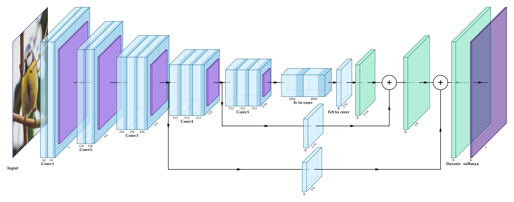
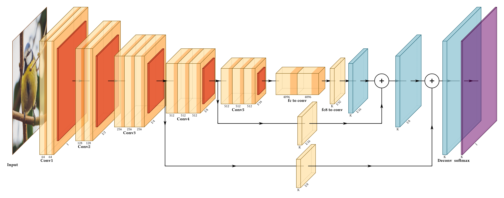
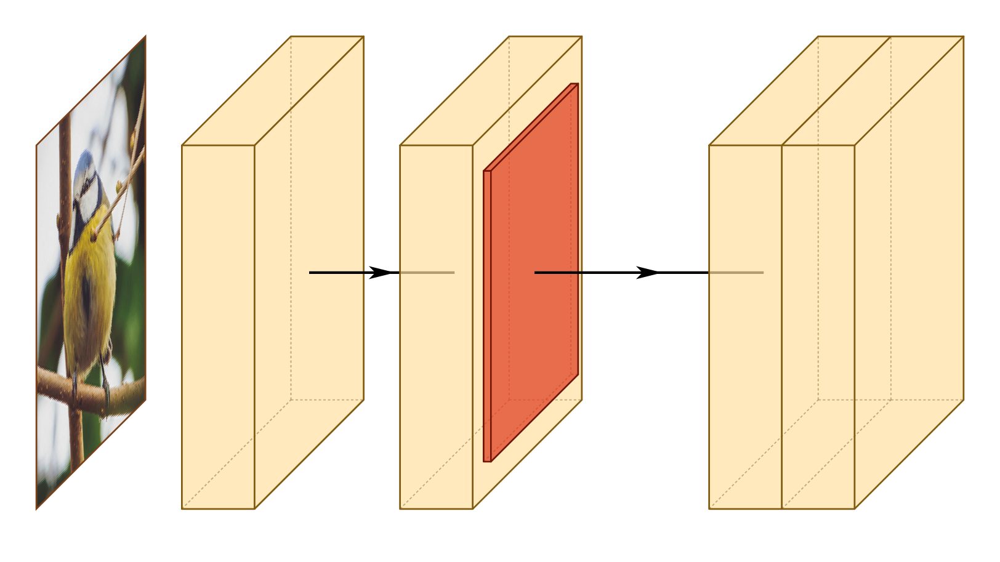
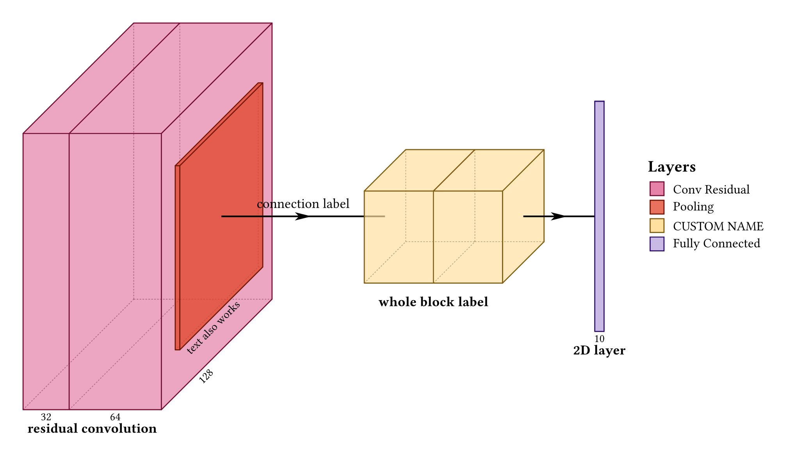
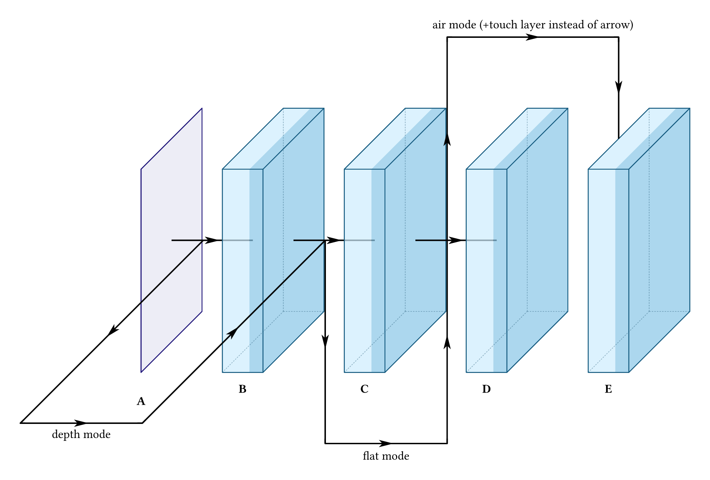
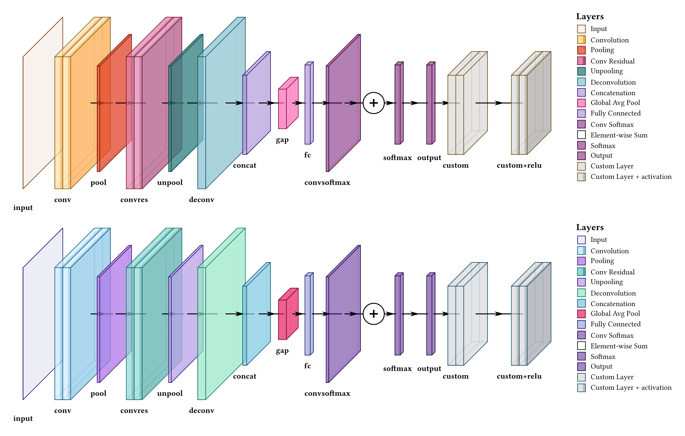
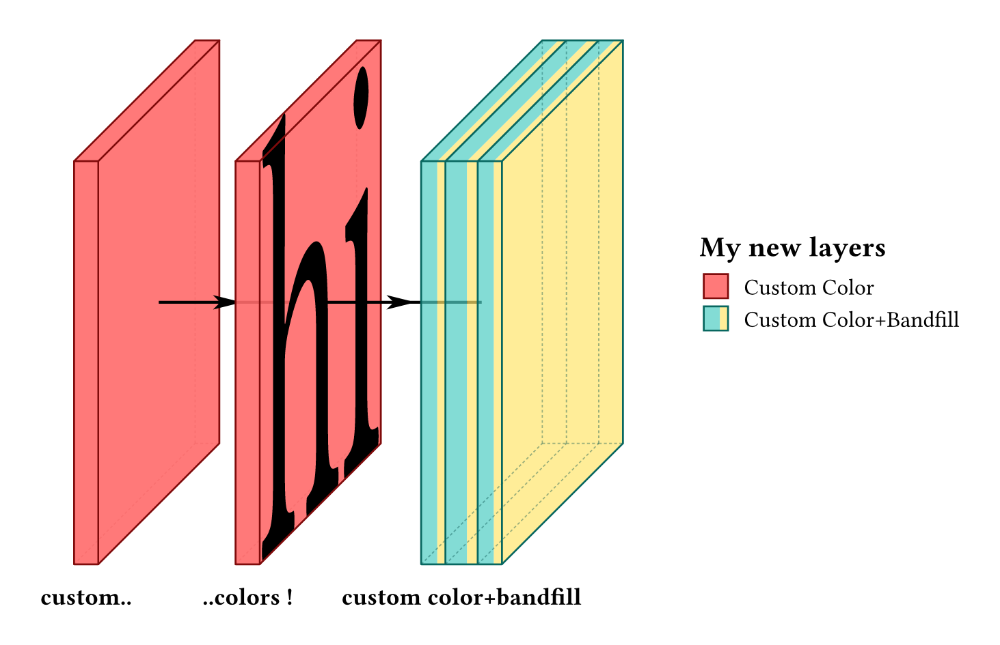
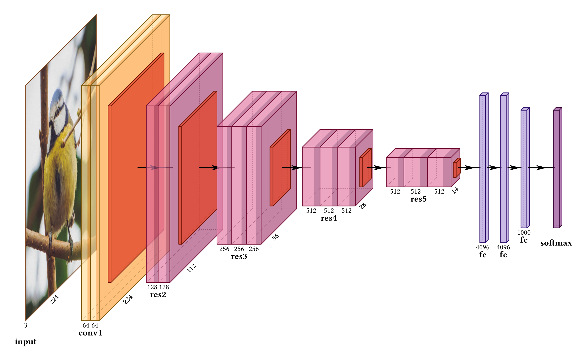
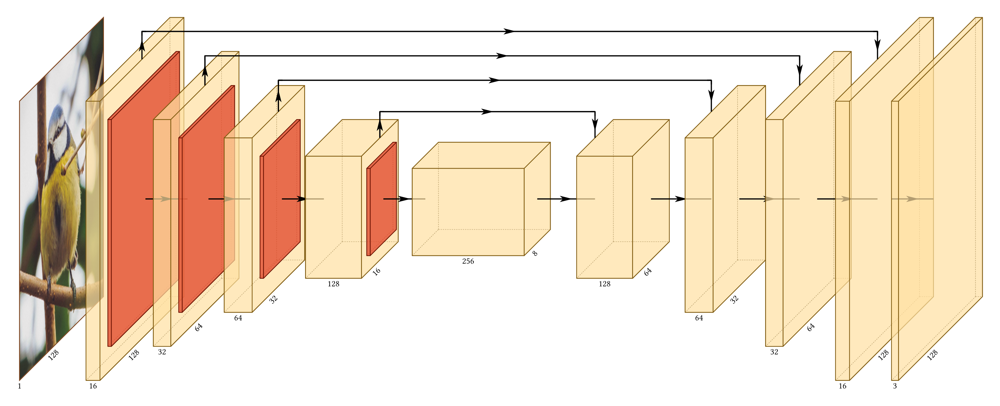

# neural-netz

Visualize Neural Network Architectures in high-quality diagrams using [Typst](https://typst.app), with style and API inspired by [PlotNeuralNet](https://github.com/HarisIqbal88/PlotNeuralNet).


[](https://hal.science/hal-05401124)&nbsp;
[](https://github.com/edgaremy/neural-netz/releases)&nbsp;
&nbsp;


<p align="center">


</p>

Under the hood, this package only uses the native Typst package [CeTZ](https://typst.app/universe/package/cetz/) for building the diagrams.

## Usage

Simply import the all-in-one drawing function from the neural-netz package:
```typ
#import "@preview/neural-netz:0.3.0": draw-network
```
You can then call `draw-network` which has the following arguments:
```typ
#draw-network(
  layers,
  connections: (),
  palette: "warm",
  show-legend: false,
  legend-title: "Layers",
  scale: 100%,
  stroke-thickness: 1,
  depth-multiplier: 0.3,
  lane-unit: 0.75,
  show-relu: false,
)
```
See the examples in the following section to understand how to use it. Alternatively, you can also start from already written architecture examples (see the Examples section, near the end).

## Getting started

Here are a few simple features for getting started.

### Basic layout

```typ
#draw-network((
    (type: "input", image: "default"),
    (type: "conv", offset: 2), // Next layers are automatically connected with arrows
    (type: "conv", offset: 2),
    (type: "pool"), // Pool layers are sticked to previous convolution block (by default))
    (type: "conv", widths: (1, 1), offset: 3) // you can offset layers
))
```
<p align="center">

</p>

For the input type layer, you can also specify a custom image by giving `image: image("path/to/your/image.jpg")`. Additionally not giving any image is equivalent to giving `image: none`.

### Dimensions and labels


```typ
#draw-network((
    (
      type: "convres", // Each layer type has its own color
      widths: (1, 2),
      channels: (32, 64, 128), // An extra channel will be used as diagonal axis label
      height: 6,
      depth: 8,
      label: "residual convolution",
    ),(
      type: "pool",
      channels: ("", "text also works"),
      height: 4,
      depth: 6,
      connection-label: "connection label", // label of the connection to the NEXT layer
    ),(
      type: "conv",
      widths: (1.5, 1.5),
      height: 2,
      depth: 3,
      label: "whole block label",
      legend: "CUSTOM NAME", // you can overwrite the default legend of predefined layers
      offset: 4,
    ),(
      type: "fc",
      channels: (10,),
      height: 5,
      depth: 0, // With no depth, the layer is drawn as a 2D rectangle
      label: "2D layer",
      offset: 2,
    ),
),
show-legend: true,
)
```
<p align="center">

</p>

Using `show-legend: true` you can add a smart legend to your visual !

And if you network does not fit the page width of your Typst document, **you can reduce the scale by giving `scale: 50%` as argument of `draw-network`** (adjust the scale value to your need).


### Label placement

Layer labels sit at a fixed spot beneath each block, so long labels on closely spaced layers overlap. Rather than spreading the layers apart to solve a typesetting problem, four per-layer options move the label itself:

| Option | Default | Effect |
|---|---|---|
| `label-orient` | `"horizontal"` | Orientation preset: `"horizontal"`, `"diagonal"` or `"vertical"` |
| `label-dx` | `0` | Shift the label horizontally |
| `label-dy` | `0` | Shift the label vertically |
| `label-anchor` | preset | Which point of the text is pinned to the label position |
| `label-angle` | `0deg` | Escape hatch for an arbitrary angle |

Labels are anchored on their baseline rather than on their bounding box, so a label containing descenders sits level with one that does not. Use `"base-east"` and `"base-west"` to anchor horizontally while keeping that alignment.

```typ
#draw-network((
  (type: "conv", widths: (0.3,), height: 3, depth: 3, label: "convolution"),
  (type: "conv", widths: (0.3,), height: 3, depth: 3, label: "downsample", offset: 0.58, label-dy: -0.55),
  (type: "conv", widths: (0.3,), height: 3, depth: 3, label: "projection", offset: 0.58),
))
```

Dropping one label to a second line clears the row. Anchoring the outer labels by their facing edges (`label-anchor: "base-east"` with a negative `label-dx`, and `"base-west"` with a positive one) fans them sideways instead.

Past a certain density no amount of shifting helps, because the labels simply do not fit side by side. Rotating them trades horizontal space, which is scarce, for vertical space, which is usually free:

```typ
(type: "conv", label: "convolution", label-orient: "diagonal")
```

`label-orient` accepts only `"horizontal"`, `"diagonal"` and `"vertical"`. Each preset pairs its angle with the anchor that places it correctly, so a diagonal label points its end at its own layer and a vertical label hangs centred beneath it, with no manual adjustment. Any other value is an error.

For an angle outside those three, use `label-angle` and pick `label-anchor` yourself, since the right anchor for an arbitrary rotation depends on where you want the text to sit. Setting both `label-orient` and `label-angle` is an error.

### Adding other connections

Extra connections route over the top of the stack by default. Pass `mode: "flat"` to route underneath, or `mode: "depth"` to run along the projection.

The main axis connections are drawn automatically, except for the input layer. You can overwrite that by using the boolean `show-connection` to tell if the connection **after** a layer should be drawn or not. You can also draw extra connections using the `connections` argument of `draw-network`. In order to make reference to a layer, it will need a `name`:

```typ
#draw-network((
  (type: "input", label: "A", name: "a", show-connection: true),
  (type: "conv", label: "B", name: "b", offset: 2),
  (type: "conv", label: "C", name: "c", offset: 2),
  (type: "conv", label: "D", name: "d", offset: 2, show-connection: false),
  (type: "conv", label: "E", name: "e", offset: 2),
), connections: (
  (from: "a", to: "c", type: "skip", mode: "depth", label: "depth mode", pos: 6),
  (from: "b", to: "d", type: "skip", mode: "flat", label: "flat mode", pos: 5),
  (from: "c", to: "e", type: "skip", mode: "air", label: "air mode (+touch layer instead of arrow)", pos: 5, touch-layer: true),
),
palette: "cold", // There is a "warm" and a "cold" color palette.
show-relu: true // visualize relu using darker color on convolution layers
)
```
<p align="center">

</p>

### Placing connections around layer depth

Layers are drawn in isometric projection, so a layer's far face leans to the right by `depth * depth-multiplier`. The **visual** gap between two adjacent layers is therefore not the `offset` between them but `offset - depth-shear(depth)`, and a connection routed into what looks like empty space will cross the previous layer's top face when that gap is too narrow.

Two helpers make this computable rather than a matter of trial and error:

```typ
#import "@preview/neural-netz:0.4.0": draw-network, depth-shear, min-clear-offset

depth-shear(6)        // 1.8  -- how far a depth-6 layer leans right
min-clear-offset(6)   // 3.6  -- smallest offset that leaves a connection room
```

A connection descending between two layers arrives at the midpoint of the arrow joining them, so it clears the shear only when half the offset exceeds it. That is what `min-clear-offset` returns. Both take a `depth-multiplier` argument, which must match the one passed to `draw-network`.

Note that the default multiplier of `0.3` has no exact binary representation, so `depth-shear(4.5)` is `1.3499999999999999`. Compare with a tolerance if you compare at all.

### Styling connections

Residual adds, concat feeds, attention routes and auxiliary supervision paths are different things, and by default they all look the same. Three per-connection options separate them:

| Option | Default | Effect |
|---|---|---|
| `color` | palette | Paint for the line and its arrowheads |
| `dash` | `none` | Any Typst dash pattern, e.g. `"dashed"`, `"dotted"` |
| `thickness` | `1` | Multiplies the palette stroke width |

```typ
(from: "b", to: "d", type: "skip", mode: "air", pos: 1.2,
 color: rgb("#73000A"), dash: "dashed", thickness: 2)
```

`thickness` multiplies rather than replaces, so a figure that passes `stroke-thickness` to `draw-network` still scales its connections. Arrowheads take the line colour, since a coloured line with black arrowheads reads as a bug rather than a choice.

#### Automatic lane heights

`pos` is measured from the centre axis, so a value that clears the blocks has to be worked out from the layer heights and depths, and every route needs its own height or they overlap. Give `pos: auto` instead:

```typ
(from: "a", to: "h", type: "skip", mode: "air", pos: auto)
```

The route is placed clear of the tallest layer, and its height comes from how far it reaches: a route spanning more blocks sits higher, so a longer route always arcs over a shorter one instead of crossing it. Reaches are ranked rather than used directly, so one long route among short ones does not leave a stack of empty lanes beneath it.

Routes of equal reach share a height. Where two of them overlap, the second is routed to the opposite side of the axis at the same height rather than being pushed further out than its reach warrants.

`lane-unit` on `draw-network` sets the spacing between heights, and `clearance` on a connection sets how far the lowest route sits from the blocks. Numeric `pos` is unaffected and keeps its current meaning.

### Predefined layer types

Here is a visualization of all the predefined layer types, in both color palettes available (`"warm"` (default) and `"cold"`). You can find their associated name underneath each layer. Of course, this is just a starting point, you can modify most of their default attributes.
<p align="center">

</p>
<p style="text-align: center;"><a href="https://github.com/edgaremy/neural-netz/blob/db550ba2eda99ffbcbb01c1e0374ea6519e16a74/examples/features/predefined-layers.typ">code for this image</a></p>

### Custom layers

If you prefer to create you own type of layers, use `type: "custom"` as a starting point. It is a generic layer, that is easily customizable. It can have one or multiple channels, with an optional "bandfill" color for symbolizing activation functions (e.g. ReLU). Note that the visiblity of activations can be set with the boolean `show-relu` at the `draw-network` scale, and can be overwritten on a per-layer basis.

A custom layer can also be added to the smart legend, when specifying a `legend` label (no need to specify the legend everytime for the same-colored custom layers).

```typ
#draw-network((
  (
    type: "custom",
    width: 0.3, height: 5, depth: 5,
    label: "custom..",
    fill: rgb("#FF6B6B"),
    opacity: 0.9,
    legend: "Custom Color",
  ),(
    type: "custom",
    width: 0.3, height: 5, depth: 5,
    label: "..colors !",
    fill: rgb("#FF6B6B"),
    opacity: 0.9,
    offset: 1.7,
    image: [hi] // Add any content (image, text etc.)
  ),(
    type: "custom",
    widths: (0.3, 0.4, 0.3), height: 5, depth: 5,
    label: "custom color+bandfill", 
    fill: rgb("#4ECDC4"),
    bandfill: rgb("#FFE66D"),
    show-relu: true,
    offset: 2,
    legend: "Custom Color+Bandfill",
  ),
),
show-legend: true,
legend-title: "My new layers" // You can also change the legend title
)
```
<p align="center">

</p>


## Examples
Here are a few network architectures implemented with neural-netz (more examples can be found [in the repo](https://github.com/edgaremy/neural-netz/tree/db550ba2eda99ffbcbb01c1e0374ea6519e16a74/examples/networks)).

<h3 style="text-align: center;">ResNet18</h3>
<p align="center">

</p>
<p style="text-align: center;"><a href="https://github.com/edgaremy/neural-netz/blob/741c71cd31d40161df44354fb65fbad7233a82aa/examples/networks/ResNet18.typ">code for this image</a></p>

<h3 style="text-align: center;">U-Net</h3>
<p align="center">

</p>
<p style="text-align: center;"><a href="https://github.com/edgaremy/neural-netz/blob/741c71cd31d40161df44354fb65fbad7233a82aa/examples/networks/U-Net.typ">code for this image</a></p>

<h3 style="text-align: center;">FCN-8</h3>
<p align="center">

</p>
<p style="text-align: center;"><a href="https://github.com/edgaremy/neural-netz/blob/741c71cd31d40161df44354fb65fbad7233a82aa/examples/networks/FCN-8.typ">code for this image</a></p>

## Cite this work
If you use the neural-netz package for a scientific publication, you can [cite its initial publication on HAL](https://hal.science/hal-05401124), indicating current version as follows:
#### APA
```
Remy, E. (2025). neural-netz, a Typst Package (Version 0.3.0) [Computer software]. https://hal.science/hal-05401124
```
#### BibTeX

```bib
@softwareversion{remy:hal-05401124v1,
  TITLE = {{neural-netz, a Typst Package}},
  AUTHOR = {Remy, Edgar},
  URL = {https://hal.science/hal-05401124},
  NOTE = {},
  YEAR = {2025},
  MONTH = Dec,
  SWHID = {swh:1:dir:c0d8294e6b01cdb5bc8703eeb51e546275244c0a;origin=https://github.com/edgaremy/neural-netz;visit=swh:1:snp:052f4efa29f793bf84901593b27254f2e0e15ffb;anchor=swh:1:rev:3669d7922f3581afc2da1f12b9e62c54e4242048},
  VERSION = {0.3.0},
  REPOSITORY = {https://github.com/edgaremy/neural-netz},
  LICENSE = {https://spdx.org/licenses/MIT-0},
  KEYWORDS = {visualization ; typst ; neural networks ; deep learning},
  HAL_ID = {hal-05401124},
  HAL_VERSION = {v1},
}
```

## Acknowledgements

This package could not have existed without the great Python+LaTeX visualization package [PlotNeuralNet](https://github.com/HarisIqbal88/PlotNeuralNet) made by Haris Iqbal. It proposes an elegant way for viewing neural networks, and its visual style was obviously a strong inspiration for the implementation of neural-netz.

Default input image was [taken from iNaturalist](https://www.inaturalist.org/observations/205901632) (colors are slightly edited).

If you feel like contributing to this package (bug fixes, features or even code refactoring), or want your model added to the model gallery, feel free to [make a PR to the neural-netz repo](https://github.com/edgaremy/neural-netz/pulls) :)